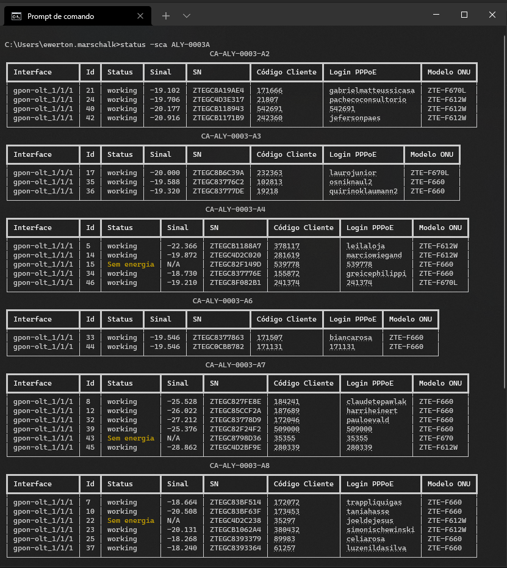

# cmdSA
Um cliente cmd para o Sistema de Ativação


## Como instalar e configurar:
### 1. Faça o download da [release](https://github.com/ewertonhm/cmdSA/releases) mais recente e extraia em uma pasta do seu computador.

### 2. Configure as variaveis de ambiente com o caminho da pasta do script:
1. Acesse o painel de controle
2. Acesse: Contas de Usuários > Contas de Usuário > Alterar as variáveis do meu ambiente.
3. Selecione a variável Path e click em Editar
4. Click em Novo e coloque o caminho da pasta em que se encontra o arquivo status.exe

### 3. Abra o prompt de comando e digita 'status' e siga as instruções. 


```
#### Links
- O cliente conta com links para o daloinfo no caso do pppoe, e para o cadastro do cliente no caso do código do cliente, porém os links são apenas exibidos usando terminais mais modernos, no windows 10 é possível utilizar o [Windows Terminal](https://www.microsoft.com/pt-br/p/windows-terminal/ "Windows Terminal"), que pode ser baixado e instalado pela Microsoft Store.
*OBS: No momento o script não funciona corretamente no PowerShell do Windows Terminal, que é o terminal padrão que ele abre ao ser executado, para contornar a situação, em configurações você pode alterar o "Perfil padrão" para Prompt de comando.*
```

## Como usar:
### Para verificar o status de um ou vários circuitos utilize:
```
status -c circuitos separado por espaços
```
exemplo:
```
status -c BNU-0700A BQE-0644B
````

### Também é possível pesquisar usando parte do nome de um circuito, para isso utilize:
```
status -all circuitos separado por espaços
```
exemplo:
```
status -all BNU-0700 BQE-06
````


### Para verificar o status de um ou vários circuitos, com a exibição separada por Caixa de Atendimento, utilize:
```
status -ca circuitos separado por espaços
```
exemplo:
```
status -ca BNU-0700A
````
*OBS: essa consulta é um pouco mais demorada que a consulta normal ao status dos circuitos, e para ser realizada, vai necessitar de acesso a tela de 
Gerenciamento de Portas FTTH no ERP, caso seu usuário no ERP não tenha acesso a essa tela, o comando não vai funcionar.*


### Para pesquisar o status de um ou vários clientes através do login pppoe utilize:
```
status -p login
```
exemplo:
```
status -p 519171
```


### Para pesquisar o status de um ou vários clientes através do serial number utilize:
```
status -sn serial
```
exemplo:
```
status -sn ZTEGC4B4D4B4
```


### para pesquisar o status de um login e do seu circuito, utilize:
```
status -c pppoe -p login
```
exemplo:
```
status -c pppoe -p 519171
```

## Status por OLT e/ou Interface de OLT:

Para realizar buscas por OLT ou Slot é necessário ter a lista de IDs das OLTs e Slots,
Incluí a lista no arquivo .zip das releases.

Caso queira gerar uma lista nova ou atualizar a lista (para acrescentar novas OLTs que possam ter sido inseridas após a lista ser gerada),
Basta rodar o script status sem argumentos.
A lista demora vários minutos para ser gerada, e necessita do chromedrive.exe salvo na pasta do script (está incluso no zip apartir da versão 2.7, mas pode não ser compátivel com a versão do seu Google Chrome, se for esse o caso é ncessário baixar uma versão compátivel no endereço: https://chromedriver.chromium.org/downloads, e substituir pela que está lá.)
  
## Comandos para busca por OLT e/ou Interface e também pelo código do cliente:

### para pesquisar o status de todos os slots de uma olt:
```
status -o olt
```
exemplo:
```
status -o OLT-GPON-VII_C-1
```
ou também:
```
status -o VII_C-1
```

### para pesquisar o status de um ou mais slots específicos de uma olt:
```
status -o olt -i interface(s)
```
exemplo:
```
status -o OLT-GPON-VII_C-1 -i gpon-olt_1/2/1	
```
ou também:
```
status -o VII_C-1 -i 1/2/1 1/2/2 1/2/3
```

### para pesquisar clientes através do codigo do bentivi em uma olt:
```
status -o olt -cod codigo(s)
```
exemplo:
```
status -o OLT-GPON-UVA_C-1 -cod 545139
```


## ONUs disponíveis para ativação e qual circuito elas percentem

### para pesquisar quais onus estão pendentes de ativação e verificar de qual circuito elas são, utilize o comando:
```
status -a olt
```
exemplo:
```
status -a OLT-GPON-UVA_C-1
```
ou também:
```
status -a UVA_C-1
```

## Verificar sinal da ONU/Circuito

### para verificar o sinal de uma ONU específica:
pelo sn:
```
status -sn serial
```
pelo pppoe:
```
status -p login
```
pelo código do cliente:
```
status -o olt -cod codigo(s)
```

### para verificar o sinal de um circuito ou CA:
Circuito:
```
status -sc circuito
```
exemplo:
```
status -sc BNU-0700A BQE-0644B
````

Circuito separado por caixa de atendimento:
```
status -sca circuito
```
exemplo:
```
status -sca BNU-0700A
````
